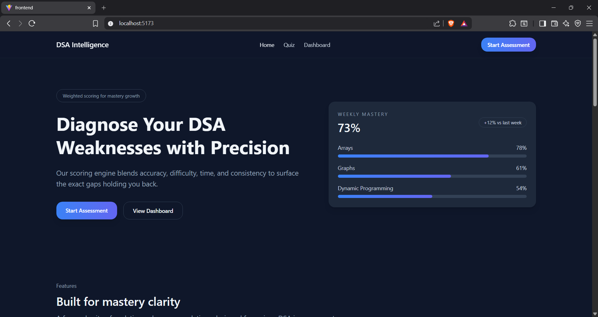
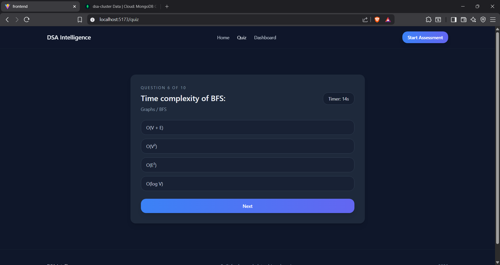
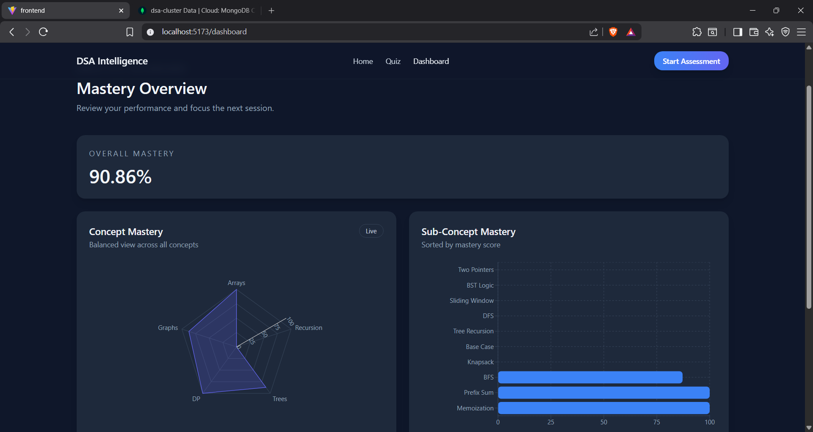

# DSA Learning Intelligence System
Diagnose DSA weaknesses with weighted mastery modeling.

## Problem Statement
DSA practice often lacks actionable feedback on which concepts are weak and why. This project provides a measurable, data-driven diagnosis of mastery so learners can focus practice with intent.

## Why This Is Different
This is not a simple quiz app. It is an analytics system that models mastery across multiple signals and adapts practice accordingly.

- Weighted scoring model blends accuracy, difficulty, time, and consistency into a single mastery score.
- Difficulty bias correction accounts for harder questions contributing more to mastery.
- Time normalization measures efficiency relative to expected time, not raw speed.
- Consistency modeling reflects stability across attempts, not just single outcomes.
- Adaptive quiz engine prioritizes weaker sub-concepts to maximize learning impact.

## Core Features
- Weighted mastery scoring
- Difficulty-adjusted accuracy
- Time efficiency normalization
- Consistency scoring
- Adaptive quiz engine
- Analytics dashboard (Radar + Bar charts)

## System Design Decisions
- Why FastAPI: async-first, clean dependency injection, and strong performance for API-heavy workloads.
- Why MongoDB: flexible schema for evolving question/response data with efficient aggregation.
- Why weighted mastery formula: transparent, interpretable scoring that aligns with learning goals.
- Why rule-based adaptation: deterministic behavior, easier validation, and lower operational risk than ML.
- Why service-layer separation: keeps routes thin and isolates business logic for testing and reuse.

## Architecture Overview
The frontend provides the learning experience and visual analytics, the backend computes mastery and recommendations, and MongoDB stores questions and user responses. The flow is: quiz responses are submitted, analytics are computed in the scoring service, and results are surfaced in the dashboard with charts and weak-area summaries.
## Architecture Diagram


## Scoring Formula
Each sub-concept mastery score is computed as a weighted blend of four signals:
- $A$ = accuracy
- $D$ = difficulty-adjusted accuracy
- $T$ = time efficiency score
- $C$ = consistency score

$$
	ext{Mastery} = w_a \cdot A + w_d \cdot D + w_t \cdot T + w_c \cdot C
$$

Weights $w_a, w_d, w_t, w_c$ are defined in backend constants.

## Folder Structure
```
.
├── backend
│   ├── routes
│   ├── services
│   ├── utils
│   ├── constants.py
│   ├── database.py
│   └── main.py
├── frontend
│   ├── src
│   │   ├── components
│   │   ├── pages
│   │   ├── services
│   │   └── types
│   └── index.html
├── question_master.json
└── README.md
```
## Screenshots
### Landing Page
<p align="center">
  
</p>

### Quiz Interface
<p align="center">
  
</p>

### Analytics Dashboard
<p align="center">
  
</p>

## Setup Instructions

### Backend
```
cd backend
python -m venv .venv
.venv\Scripts\activate
pip install -r requirements.txt
copy .env.example .env
```
Update `.env` with your MongoDB Atlas URI and database name, then run:
```
uvicorn main:app --reload
```

### Frontend
```
cd frontend
npm install
npm run dev
```

## Future Improvements
- Progress tracking across sessions
- Confidence modeling per concept
- ML-based adaptive engine
- Deployment scaling and observability

## License
MIT License
